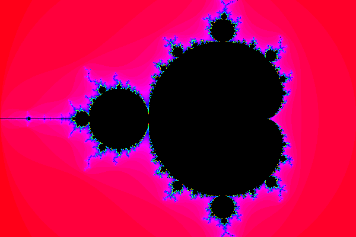
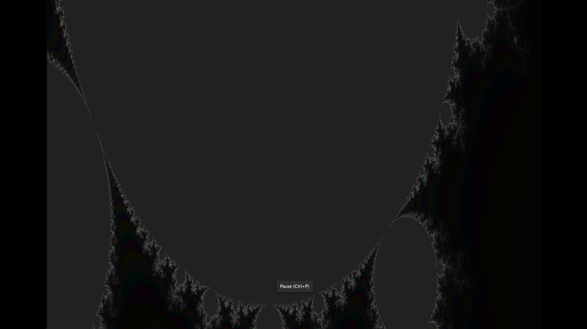
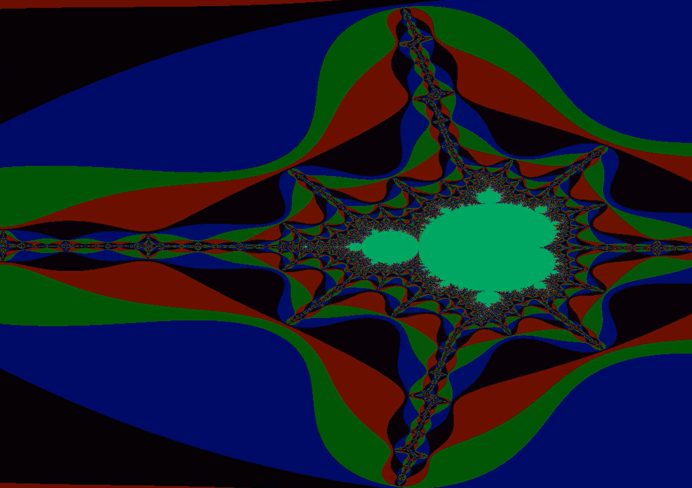

## .اولش برام خیلی سخت بود

<!-- [my favorite website](http://www.google.com) -->

خیلی استرس داشتم و اصلا نمیدونستم از کجا باید شروع کنم. تا اینکه استاد یک جلسه رفع اشکال برگزار کردند.  بعد شرکت در اون جلسه کلی از ابهاماتم برطرف شد. بعد از چند روز شروع کردم به انجام پروژه.اول یکم با کد زده شده در پایتون سر و کله زدم و سعی کردم همه توابع تعریف شده رو به خوبی درک کنم تا بتونم مشابه اون ها رو در سی پیاده کنم.عکس زیر اولین عکس تولید شده در پایتون بود

---
<!-- **Test**: This is atest -->

بعد رفتم سراغ زدن کد ها به زبان سی. یکی دوبار موقع تعریف توابع به مشکل خوردم ولی خوشبختانه با راهنمایی دوستان تونستم اون مشکلات رو برطرف کنم. تا اینکه بالاخره تونستم اولین عکس های سیاه و سفید رو تولید کنم. عکس زیر یه نمونه از عکس های تولید شده در این مرحله بود
 

برای مرحله دوم پروژه هم باید روی تابع تغییر رنگ کار میکردیم و هم یه موسیقی متناسب با ویدیو با استفاده از سانیک پای تولید کردیم و در نهایت با هم پیوند دادیم. شکل زیر یه نمونه از عکس های تولید شده در این مرحلست

